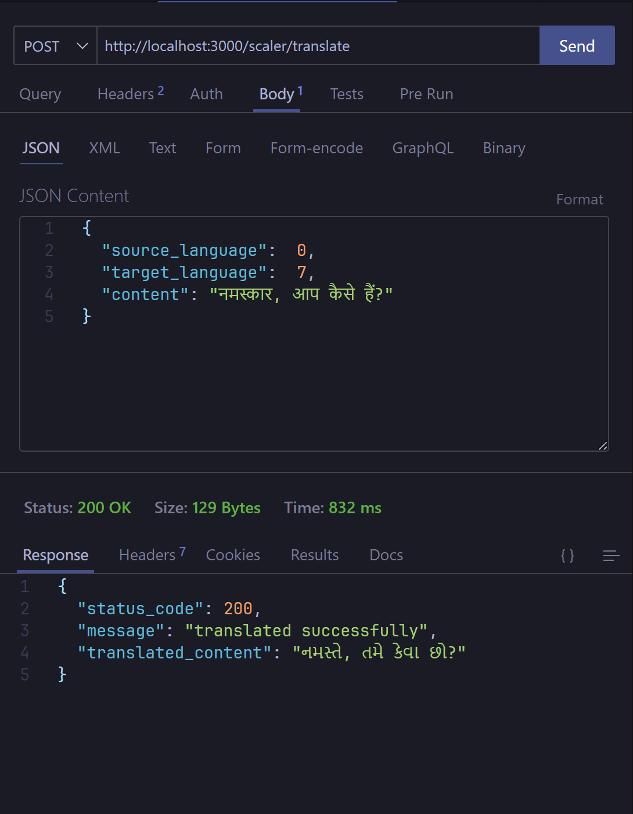

# Bashini Regional Translater
Translate From one regional language to another.

# Language Codes

| code | Language |
|-------|----------|
|   0   |    hindi    |
|   1   |    tamil    |
|   2   |    telugu    |
|   3   |    malayalum    |
|   4   |    marathi    |
|   5   |    bengali    |
|   6   |    assamese    |
|   7   |    gujrati    |
|   8   |    kannada    |
|   9   |    oriya    |
|  10   |    punjabi    |


# Endpoints

## `/scaler/translate/`
####  Payload Schema
```json
{
    "source_language": "integer",
    "content": "string",
    "target_language": "integer"
}
```
### Responses
- #### 200 OK
    ```json
    {
        "status_code": 200,
        "message": "translated successfully",
        "translated_content": "string"
    }
    ```

- #### 400 Bad Request
    ```json
    {
        "status_code": 400,
        "message": "language code out of bounds"
    }
    ```

- #### 500 Server Error
    ```json
    {
        "status_code": 500,
        "message": "An error occured while translating the content."
    }
    ```

## Screenshots


## Setting up locally
```bash
# install the depenencies
yarn

# make a .env file
cp .env.example .env

# start the development server
yarn dev
```